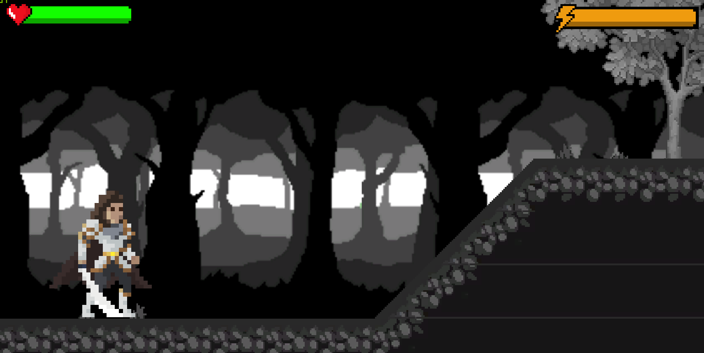
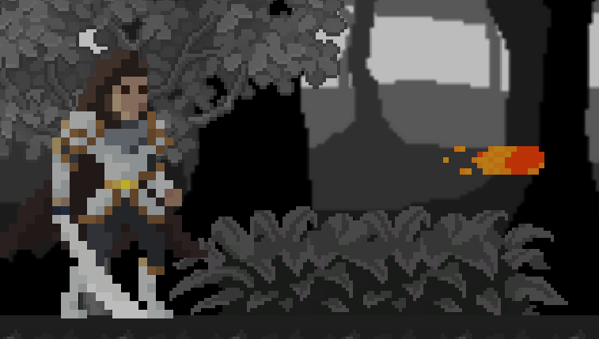
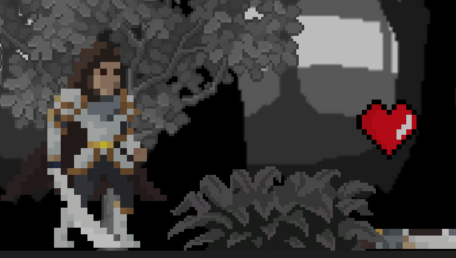
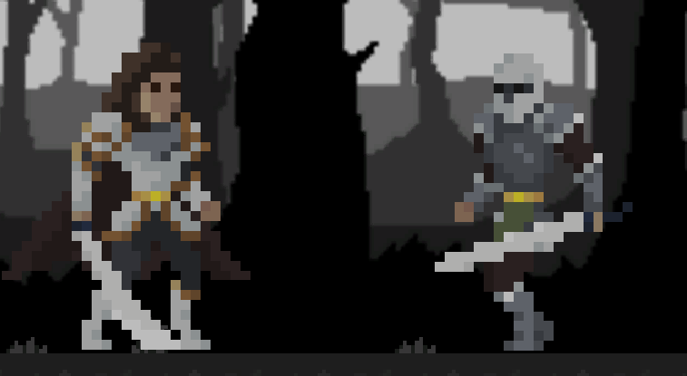

# Previous Games I have made

  [2nd year Pratical Project Medievil Magic Game](https://oscarw2510.github.io/Artist-WebGl/?1+1=44)
  
  [2nd Year Practical Project Gameplay ](https://youtu.be/0QD6ead7Uus)
  
  [2nd Year Game Jam ](https://oscarw2510.github.io/GameJamWebGL/)

 
 <a href="game.html"> Play my 1st year FMP Game. </a>
 
  .[FMP Gameplay](https://www.youtube.com/watch?v=RUd6ki2dnlc)

# Reskin of my 2nd year Game
 [Actual game with all the Reskinned assets](https://oscarw2510.github.io/Artist-change-game/)
 
 - Credit to: Harriet Woodhams and Olivia Hudson

  
  
  
  
  

# Artwork and Images of my own work 

   
   
   
   
   
   
   
   
   
   
   
   
   
  
 
  
